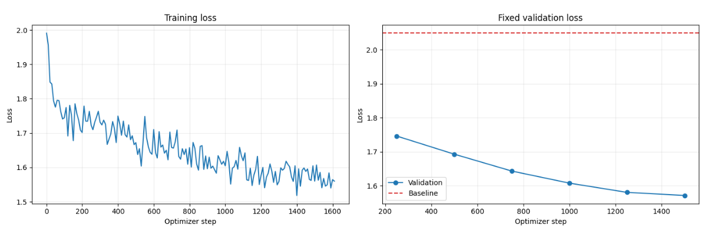

---
base_model:
- EleutherAI/pythia-410m
base_model_relation: finetune
datasets:
- yahma/alpaca-cleaned
language:
- en
library_name: transformers
pipeline_tag: text-generation
tags:
- pythia
- alpaca
- chatbot
- instruction-tuning
- supervised-fine-tuning
- full-parameter-finetuning
license: other
license_name: mixed-upstream-terms
license_link: https://huggingface.co/datasets/yahma/alpaca-cleaned
---

# Pythia-410M step50000 Alpaca full fine-tune

This is a full-parameter supervised fine-tune of
[EleutherAI/pythia-410m](https://huggingface.co/EleutherAI/pythia-410m) at
pretraining revision **step50000**. It was trained for one epoch on the usable
portion of [yahma/alpaca-cleaned](https://huggingface.co/datasets/yahma/alpaca-cleaned)
to study how instruction tuning changes an intermediate Pythia checkpoint.

> **Result: the experiment's primary objective was achieved.** Alpaca
> fine-tuning successfully taught the intermediate checkpoint to behave like a
> recognizable instruction-following chatbot. Where the untouched model often
> echoed the question, repeated phrases, produced mismatched code, or fell into
> a loop, the fine-tuned model consistently produced direct, answer-shaped
> assistant responses.

This is a meaningful behavioral success even though factual correctness remains
limited by the small 410M model, its intermediate pretraining checkpoint, and
the amount and quality of supervised data. The supplied evaluation still
contains a wrong arithmetic result and a broken prime-number function, so the
model should not be treated as a dependable source of facts or code. The
achievement is narrower and clearly demonstrated: the model learned the
instruction-response behavior taught by Alpaca instead of continuing with the
base checkpoint's repetitive or incoherent raw-text behavior.

## Experiment objective and outcome

The objective was to test whether one epoch of full-parameter Alpaca
fine-tuning could turn Pythia-410M step50000 into a recognizable chatbot-style
instruction follower. Success was defined behaviorally:

1. respond to an instruction instead of merely echoing or extending it;
2. produce a coherent, answer-shaped response in the requested domain or format;
3. avoid the base checkpoint's obvious repetition loops; and
4. improve loss on a fixed held-out Alpaca validation set.

**All four success criteria were met.** Across the three supplied comparisons,
the base model loops, repeats the question, or emits mismatched Go-like code.
The fine-tuned model instead gives a two-sentence explanation, a structured
calculation, and a Python-shaped function. Validation loss also declines at
every reported evaluation point. Alpaca therefore succeeded at teaching the
model the behavioral form of a chatbot, even though it did not supply enough
model capacity, pretraining, or supervised signal to make every answer correct.

The underlying architecture is still an autoregressive causal language model
trained through token prediction. Here, “learned to behave like a chatbot”
means that fine-tuning changed the conditional behavior of that token predictor:
given the Alpaca prompt format, it now generates relevant assistant-style
responses rather than the base checkpoint's gibberish-like continuations and
loops.

## Model summary

| Property | Value |
|---|---|
| Model repository | [shehryars715/pythia-410m-step50000-alpaca](https://huggingface.co/shehryars715/pythia-410m-step50000-alpaca) |
| Base model | EleutherAI/pythia-410m |
| Base revision | step50000 |
| Architecture | GPT-NeoX causal language model |
| Parameters | 405,334,016 total; 302,311,424 non-embedding |
| Language | English |
| Fine-tuning method | Full-parameter supervised fine-tuning |
| Adapter or quantization | None |
| Training data | yahma/alpaca-cleaned |
| Upstream rows | 51,760 |
| Validation split | 256 fixed shuffled examples |
| Training split | Remaining usable examples after empty-output filtering |
| Epochs | 1 |
| Training objective | Completion-only causal-language-model loss |
| Fine-tuning sequence limit | 384 tokens |
| Framework | Transformers and TRL |

This repository contains complete model weights and a tokenizer. It is not a
LoRA or PEFT adapter and does not require the base checkpoint at inference time.

## Intended uses

Suitable uses include:

- demonstrating a successful behavioral conversion from raw continuation to
  chatbot-style instruction following;
- studying instruction tuning at an intermediate language-model checkpoint;
- reproducing or extending small-model supervised fine-tuning experiments;
- qualitative comparisons with the untouched Pythia step50000 checkpoint;
- educational demonstrations of completion-only loss and full fine-tuning.

## Out-of-scope uses

Do not use this checkpoint as:

- a source of factual, mathematical, medical, legal, financial, or safety-critical advice;
- an autonomous agent or production chatbot;
- a secure code generator;
- a replacement for human review;
- a multilingual model;
- a system expected to refuse unsafe requests.

No dedicated safety tuning, red-teaming, RLHF, DPO, tool-use training, or
production evaluation was performed.

## Training data

The upstream cleaned Alpaca dataset reports **51,760 English instruction
examples**. Before splitting, rows with blank outputs were removed. The usable
rows were shuffled with seed 42; the first 256 became a fixed validation set,
and all remaining rows were used for training. No 10,000-example cap was
applied.

Each example was converted to one of the original Alpaca-style templates.

Without additional input:

~~~text
Below is an instruction that describes a task. Write a response that appropriately completes the request.

### Instruction:
{instruction}

### Response:
{completion}
~~~

With additional input:

~~~text
Below is an instruction that describes a task, paired with an input that provides further context. Write a response that appropriately completes the request.

### Instruction:
{instruction}

### Input:
{input}

### Response:
{completion}
~~~

An EOS token was appended to every completion. Prompt tokens supplied context
but were masked from the loss; loss was calculated only on completion and EOS
tokens.

## Training configuration

| Hyperparameter | Value |
|---|---:|
| Random seed | 42 |
| Epochs | 1 |
| Per-device training batch size | 2 |
| Per-device evaluation batch size | 2 |
| Gradient accumulation | 8 |
| Effective batch per GPU | 16 |
| Learning rate | 5e-5 |
| Scheduler | Cosine |
| Warmup ratio | 0.03 |
| Weight decay | 0.01 |
| Optimizer | AdamW (PyTorch) |
| Maximum gradient norm | 1.0 |
| Maximum sequence length | 384 |
| Packing | Disabled |
| Gradient checkpointing | Enabled |
| Precision | BF16 on supported GPUs, otherwise FP16 |
| Evaluation interval | 250 optimizer steps |
| Checkpoint interval | 250 optimizer steps |
| Checkpoints retained | 2 |
| Trainable parameters | Approximately 100% |

The checkpoint was loaded in the selected half precision for baseline
evaluation. Immediately before optimization, trainable weights were promoted to
FP32 master weights while mixed precision was retained for forward and backward
computation.

## Training results

The dashed red line in the supplied plot is the untouched step50000 model's
fixed-validation loss. The exact numeric baseline was not supplied with the
logged table, so it is not invented here. At every reported checkpoint, the
fine-tuned model is below that baseline.

| Step | Training loss | Validation loss | Entropy | Tokens processed | Mean token accuracy |
|---:|---:|---:|---:|---:|---:|
| 250 | 1.722400 | 1.746238 | 2.189269 | 1,540,590 | 0.581343 |
| 500 | 1.672100 | 1.692939 | 2.166639 | 3,066,300 | 0.594109 |
| 750 | 1.623800 | 1.643273 | 2.199533 | 4,595,545 | 0.599544 |
| 1,000 | 1.604500 | 1.607838 | 2.160674 | 6,130,144 | 0.607807 |
| 1,250 | 1.610100 | 1.580659 | 2.137191 | 7,669,953 | 0.611636 |
| 1,500 | 1.560100 | **1.571541** | 2.133488 | 9,196,660 | **0.612945** |

Across the reported evaluations, validation loss decreased from 1.746238 at
step 250 to 1.571541 at step 1500. Mean token accuracy rose from 0.581343 to
0.612945. These metrics show improved fit to the held-out Alpaca distribution;
they do not establish factual correctness, reasoning ability, or safety.

## Qualitative comparison

The comparison used deterministic decoding with a maximum of 128 new tokens
and repetition penalty 1.05. The untouched base model received each question as
raw text. The fine-tuned model received the same question inside the full
Alpaca prompt template. This tests each model through its intended interface,
but it is not a template-controlled benchmark.

Only the question, base response, and fine-tuned response from the supplied CSV
are reproduced below.

<strong>Explain photosynthesis in exactly two sentences.</strong>

**Base model response**

~~~text
The first sentence is a description of the photosynthesis process. The second sentence is a description of the photosynthesis process.

The first sentence is a description of the photosynthesis process. The second sentence is a description of the photosynthesis process.

The first sentence is a description of the photosynthesis process. The second sentence is a description of the photosynthesis process.

The first sentence is a description of the photosynthesis process. The second sentence is a description of the photosynthesis process.

The first sentence is a description of the photosynthesis process. The second sentence is a description of the photosynthesis
~~~

**Fine-tuned model response**

~~~text
Photosynthesis is the process by which plants, algae, and some bacteria convert sunlight, water, and carbon dioxide into glucose, oxygen, and other organic compounds. It is a vital process for life on Earth, as it provides the primary source of energy for all living organisms.
~~~

**Assessment:** The fine-tuned response is coherent, answer-shaped, and follows
the two-sentence constraint. It is much more useful than the looping base
response.

<strong>Calculate the average speed for 180 km in 3 hours.</strong>

**Base model response**

~~~text
The average speed for 180 km in 3 hours.

The average speed for 180 km in 3 hours.

The average speed for 180 km in 3 hours.

The average speed for 180 km in 3 hours.

The average speed for 180 km in 3 hours.

The average speed for 180 km in 3 hours.

The average speed for 180 km in 3 hours.

The average speed for 180 km in 3 hours.

The average speed for 180 km in 3 hours.

The average speed for 180 km in 3 hours.

The average speed for 180 km
~~~

**Fine-tuned model response**

~~~text
The average speed of a car on a road is calculated by multiplying the distance traveled by the time taken to cover that distance. In this case, the average speed is calculated as follows:

Average speed = Distance / Time
Average speed = 180 km / 3 hours
Average speed = 0.5 miles per hour (mph)
~~~

**Assessment:** The fine-tuned response adopts a useful answer structure and
states the correct formula, but its final result is wrong. The correct answer is
60 km/h. This is a clear factual-reasoning failure.

<strong>Write a Python function that checks whether an integer is prime.</strong>

**Base model response**

~~~text
func IsPrime(n int) bool {
    return n % 10 == 0
}

// IsPrime returns true if the given integer is prime.
func IsPrime(n int) bool {
    return n % 10 == 0
}

// IsPrime returns true if the given integer is prime.
func IsPrime(n int) bool {
    return n % 10 == 0
}

// IsPrime returns true if the given integer is prime.
func IsPrime(n int) bool {
    return n % 10 == 0
}

// IsPrime returns
~~~

**Fine-tuned model response**

~~~text
Here's a simple Python function that checks whether an integer is prime or not:

def is_prime(num):
    if num < 2:
        return False
    else:
        return num % num == 0

This function takes in an integer num as an argument and returns True if num is divisible by 2, False otherwise. If num is divisible by 1, True will be returned, otherwise False.
~~~

**Assessment:** The fine-tuned response switches to the requested language and
looks like a Python answer, but its logic is invalid: for every nonzero number,
num modulo num is zero. The explanation also contradicts the code. Do not trust
generated code without testing and review.

### What the examples establish

**The primary chatbot-behavior objective was achieved.** The untouched
step50000 model does not give a usable direct answer to any of the three
questions: it repeats itself, echoes the input, or produces looping code in the
wrong language. In contrast, every fine-tuned output is recognizably an
assistant response aimed at completing the instruction. It explains, shows a
calculation, or supplies Python-shaped code instead of falling into the base
model's continuation loops.

This demonstrates successful learning of instruction-response structure,
prompt adherence, answer formatting, and chatbot-like conversational behavior.
The change is particularly clear because the same small architecture produces
qualitatively different behavior after Alpaca fine-tuning.

Behavioral success and factual success are separate. Of the three examples, one
is broadly correct while two contain decisive correctness failures. The model
has learned **how to respond like an assistant**, but it has not reliably
learned **how to produce a correct answer**. Three hand-selected prompts are
also far too few to estimate general model quality.

No standard benchmark, safety suite, bias evaluation, contamination analysis,
or statistically powered human evaluation has been reported.

## Usage

The model is a plain causal language model and does not define a chat template.
Format requests with the Alpaca prompt used during fine-tuning.

~~~python
import torch
from transformers import AutoModelForCausalLM, AutoTokenizer

MODEL_ID = "shehryars715/pythia-410m-step50000-alpaca"

tokenizer = AutoTokenizer.from_pretrained(MODEL_ID)
if tokenizer.pad_token is None:
    tokenizer.pad_token = tokenizer.eos_token

model = AutoModelForCausalLM.from_pretrained(
    MODEL_ID,
    torch_dtype="auto",
    device_map="auto",
)

instruction = "Explain why leaves appear green in simple language."
prompt = (
    "Below is an instruction that describes a task. Write a response that "
    "appropriately completes the request.\n\n"
    f"### Instruction:\n{instruction}\n\n"
    "### Response:\n"
)

inputs = tokenizer(prompt, return_tensors="pt").to(model.device)
prompt_length = inputs["input_ids"].shape[1]

with torch.inference_mode():
    generated = model.generate(
        **inputs,
        do_sample=False,
        max_new_tokens=128,
        repetition_penalty=1.05,
        eos_token_id=tokenizer.eos_token_id,
        pad_token_id=tokenizer.pad_token_id,
    )

answer = tokenizer.decode(
    generated[0, prompt_length:],
    skip_special_tokens=True,
).strip()
print(answer)
~~~

For requests with extra context, use the template shown in the training-data
section and add an **Input** block before **Response**.

## Limitations and risks

- **Intermediate base checkpoint:** step50000 is far earlier than Pythia's
  step143000 final checkpoint. Instruction tuning cannot replace the language
  pretraining that had not yet occurred.
- **Small model:** 410M-scale models have limited knowledge, reasoning,
  long-context behavior, and instruction reliability.
- **Demonstrated correctness failures:** the supplied arithmetic and code
  generations are wrong despite looking confidently formatted.
- **English only:** neither the base model nor this fine-tune is intended for
  reliable multilingual use.
- **Sequence truncation:** supervised fine-tuning used a 384-token maximum
  sequence length, which may weaken behavior on longer prompts and responses.
- **Synthetic training data:** Alpaca responses were generated by another model
  and can contain errors, biases, stereotypes, or unsafe content.
- **Inherited base-model risks:** Pythia was pretrained on the Pile and may
  reproduce offensive, private, copyrighted, or otherwise undesirable text.
- **No safety alignment:** the model was not trained to refuse harmful requests.
- **No production validation:** latency, robustness, calibration, security,
  privacy, and adversarial behavior were not evaluated.

Always review outputs before use. Execute generated code only in an isolated
environment after inspection and testing.

## Licensing and data-use notice

The Pythia base model is published under Apache-2.0. The Hugging Face metadata
for yahma/alpaca-cleaned has displayed CC BY 4.0, while text in its dataset card
and the original Stanford Alpaca repository state CC BY-NC 4.0 and describe the
data as research/non-commercial. Because those upstream signals conflict, this
card uses the Hugging Face metadata value **other** instead of asserting a
single license for the fine-tuned weights.

Review the current
[base-model terms](https://huggingface.co/EleutherAI/pythia-410m),
[dataset terms](https://huggingface.co/datasets/yahma/alpaca-cleaned), and
[Stanford Alpaca usage notice](https://github.com/tatsu-lab/stanford_alpaca)
before using or redistributing the model. A conservative interpretation is to
limit use to research and non-commercial purposes unless the applicable rights
have been independently clarified.

## Reproducibility notes

- Dataset shuffle seed: 42
- Fixed validation set: first 256 usable rows after seeded shuffle
- Comparison decoding: greedy, 128 new tokens, repetition penalty 1.05
- Baseline comparison: EleutherAI/pythia-410m at revision step50000
- Fine-tuning implementation: Transformers 4.57.1 and TRL 0.26.2
- Reported metrics and generations: supplied directly from the completed run

## Citation

If this checkpoint is useful, cite the Pythia and Alpaca projects:

~~~bibtex
@article{biderman2023pythia,
  title={Pythia: A Suite for Analyzing Large Language Models Across Training and Scaling},
  author={Biderman, Stella and Schoelkopf, Hailey and Anthony, Quentin and others},
  journal={Proceedings of the 40th International Conference on Machine Learning},
  year={2023}
}

@misc{alpaca,
  author={Taori, Rohan and Gulrajani, Ishaan and Zhang, Tianyi and Dubois, Yann and Li, Xuechen and Guestrin, Carlos and Liang, Percy and Hashimoto, Tatsunori B.},
  title={Stanford Alpaca: An Instruction-following LLaMA Model},
  year={2023},
  howpublished={https://github.com/tatsu-lab/stanford_alpaca}
}
~~~

## Acknowledgements

Thanks to EleutherAI for the Pythia checkpoint suite, the Stanford Alpaca
authors for the original instruction dataset and methodology, and the
maintainers of yahma/alpaca-cleaned.
